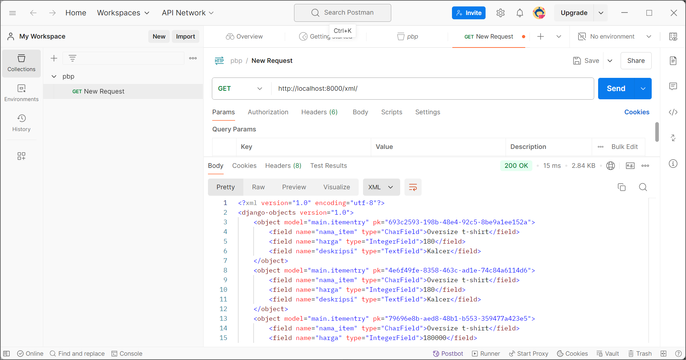
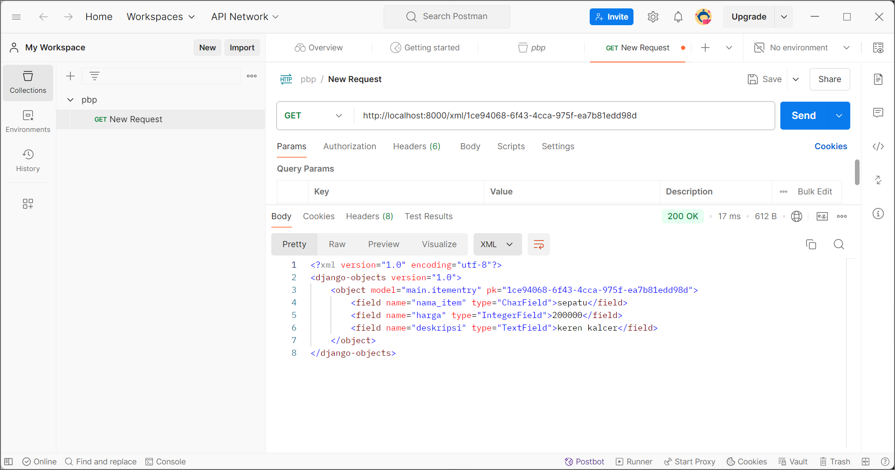
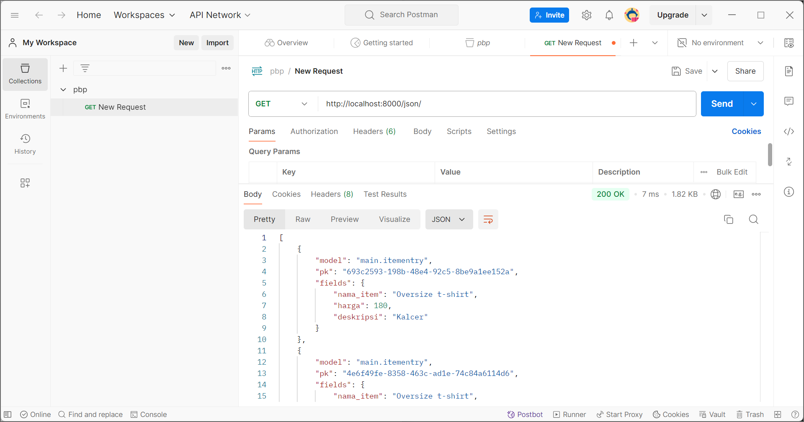
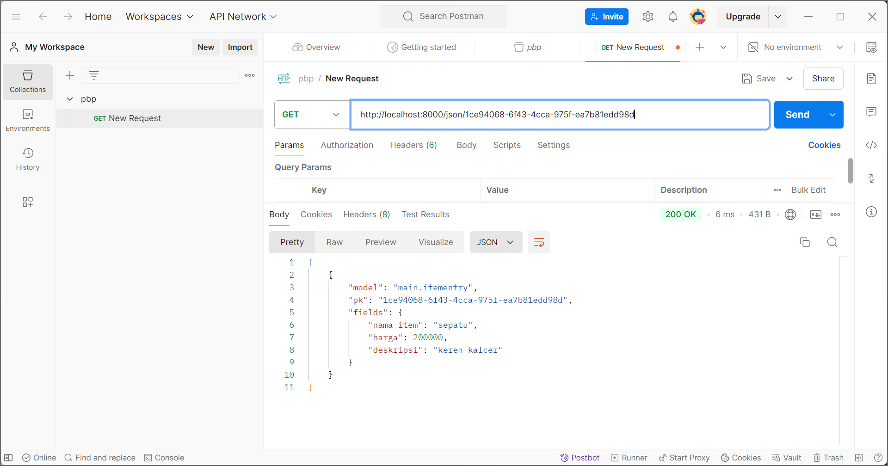

1) Jelaskan bagaimana cara kamu mengimplementasikan checklist di atas secara step-by-step (bukan hanya sekadar mengikuti tutorial).
- Buat repositori lokal mental-health-tracker dan hubungkan ke GitHub menggunakan git init dan git remote add origin.

- Git terpasang, konfigurasi nama pengguna dan email untuk commit, serta aktifkan Git Credential Manager.

- Buat virtual environment, instal dependencies menggunakan pip install.

- Inisialisasi proyek Django dengan django-admin startproject, atur allowed hosts di settings.py.

- Buat aplikasi baru bernama main, daftarkan di INSTALLED_APPS.

- Definisikan model MoodEntry di models.py, lalu migrasi dengan makemigrations dan migrate.

- Buat view di views.py, hubungkan dengan template HTML melalui context di main.html.

- Atur routing URL di urls.py untuk menghubungkan aplikasi dengan halaman utama.

- Tulis unit test di tests.py, jalankan dengan python manage.py test.

- Lakukan deployment aplikasi ke PWS dan pastikan URL deployment berfungsi.

2)  Buatlah bagan yang berisi request client ke web aplikasi berbasis Django beserta responnya dan jelaskan pada bagan tersebut kaitan antara urls.py, views.py, models.py, dan berkas html.
Pertama mengirimkan request ke URL aplikasi, lalu urls.py mencocokkan URL tersebut dengan fungsi view yang sesuai. views.py memproses logika bisnis dan, jika diperlukan, mengambil data dari models.py, yang mengelola query ke database. Setelah itu, data tersebut dikirimkan ke template HTML untuk di-render. Akhirnya, Django mengirimkan respon dalam bentuk halaman HTML kembali untuk ditampilkan di browser.

3)  Jelaskan fungsi git dalam pengembangan perangkat lunak!
Git dalam pengembangan perangkat lunak berfungsi sebagai sistem kontrol versi yang memudahkan pengembang untuk melacak perubahan kode, berkolaborasi dalam tim, dan menjaga versi yang stabil dari suatu proyek

4)  Menurut Anda, dari semua framework yang ada, mengapa framework Django dijadikan permulaan pembelajaran pengembangan perangkat lunak?
Django dipilih sebagai framework pembelajaran awal karena memiliki struktur yang jelas dan lengkap, seperti model, view, dan template, serta mendukung pengembangan cepat dengan fitur bawaan yang kuat seperti ORM, sehingga cocok untuk pemahaman dasar pengembangan aplikasi web.

5)  Mengapa model pada Django disebut sebagai ORM?

Model pada Django disebut ORM karena berfungsi sebagai alat yang menghubungkan basis data relasional dengan objek dalam kode Python. Dengan ORM, pengembang dapat mengelola database menggunakan kode Python tanpa harus menulis query SQL secara langsung, sehingga mempermudah interaksi dengan database.

TUGAS 3

1. Mengapa kita memerlukan data delivery?

Data delivery dibutuhkan untuk memungkinkan server dan klien saling bertukar informasi secara langsung tanpa perlu me-refresh halaman. Hal ini membuat aplikasi lebih efisien dan memberikan pengalaman yang lebih baik bagi pengguna.

2. Mana yang lebih unggul, XML atau JSON? Mengapa JSON lebih sering digunakan?

JSON dinilai lebih unggul karena memiliki format yang lebih ringkas, lebih mudah dibaca oleh manusia, dan lebih cepat diproses dibandingkan XML. Karena kesederhanaannya, JSON menjadi pilihan lebih populer dalam pengembangan aplikasi modern.

3. Apa fungsi dari is_valid() pada form Django?

Fungsi is_valid() digunakan untuk memeriksa apakah data yang diinput ke dalam form sudah sesuai dengan aturan yang berlaku. Fungsi ini penting untuk memastikan data yang masuk aman dan sesuai sebelum diproses lebih lanjut atau disimpan di database.

4. Mengapa kita memerlukan csrf_token pada form di Django?

csrf_token berfungsi untuk melindungi form dari serangan CSRF (Cross-Site Request Forgery), yang bisa terjadi jika ada pihak luar yang mencoba mengirimkan permintaan palsu atas nama pengguna. Tanpa csrf_token, aplikasi dapat menjadi rentan terhadap eksploitasi ini.

5. Bagaimana cara kamu mengimplementasikan checklist di atas secara langkah demi langkah?

-Saya mulai dengan membuat model dan form yang diperlukan.
-Selanjutnya, saya membuat views untuk menangani input form dan memvalidasi datanya.
-Dalam template form, saya menambahkan csrf_token untuk keamanan.
-Setelah itu, saya menyiapkan views yang menampilkan data dalam format XML dan JSON.
-Saya melakukan testing dengan Postman dan memastikan semua berjalan dengan baik sebelum melakukan deployment ke PWS

Screenshot Postman
XML

JSON

TUGAS 4

1) Apa perbedaan antara HttpResponseRedirect() dan redirect()
-HttpResponseRedirect() digunakan untuk mengarahkan pengguna ke URL baru dengan kode status 302.
-redirect() adalah fungsi yang lebih simpel dan fleksibel, karena bisa menerima URL, nama view, atau objek, lalu otomatis menggunakan HttpResponseRedirect() di balik layar.

2) Jelaskan cara kerja penghubungan model Product dengan User!
Model Product dapat dihubungkan dengan User menggunakan ForeignKey, yang berarti setiap produk dimiliki oleh satu pengguna. Ini memungkinkan tiap pengguna memiliki daftar produk yang mereka buat.

3) Apa perbedaan antara authentication dan authorization, dan bagaimana pengguna login di Django?
Authentication memverifikasi identitas pengguna (misal, login), sedangkan authorization menentukan hak akses pengguna (misal, bisa edit data atau tidak). Saat login, Django melakukan authentication dengan memvalidasi username dan password. Django mengelola authentication menggunakan authenticate() dan login(), sedangkan authorization dilakukan lewat permissions yang diberikan ke pengguna.

4) Bagaimana Django mengingat pengguna yang telah login?
Django menggunakan session cookies untuk mengingat pengguna yang telah login. Cookie ini menyimpan ID session di browser pengguna. Cookies juga bisa digunakan untuk keperluan lain seperti menyimpan preferensi pengguna, tetapi tidak semua cookies aman, terutama jika tidak dienkripsi.

5) Jelaskan bagaimana cara kamu mengimplementasikan checklist di atas secara step-by-step (
-Membuat fungsi register dan login
Di views.py, saya menambahkan fungsi register() menggunakan UserCreationForm untuk memudahkan pengguna dalam membuat akun. Kemudian, saya menambahkan fungsi login_user() yang menggunakan AuthenticationForm untuk autentikasi pengguna.

-Membuat halaman register dan login
Saya membuat dua file HTML baru, yaitu register.html dan login.html, masing-masing untuk menampilkan form pendaftaran dan login. Kedua file ini memanfaatkan template dari base.html.

-Menambahkan URL path untuk register dan login
Di urls.py, saya menambahkan path baru untuk fungsi register dan login, sehingga pengguna bisa mengakses halaman pendaftaran dan login melalui URL /register/ dan /login/.

-Membuat fungsi logout
Saya menambahkan fungsi logout_user() di views.py yang memanfaatkan Django logout() untuk menghapus sesi pengguna yang sedang login dan mengarahkan kembali ke halaman login.

-Restriksi akses halaman utama
Untuk memastikan hanya pengguna yang sudah login bisa mengakses halaman utama, saya menggunakan @login_required di atas fungsi show_main() di views.py. Jika pengguna belum login, mereka akan diarahkan ke halaman login.

-Menghubungkan model dengan User
Di model MoodEntry, saya menambahkan user = models.ForeignKey(User, on_delete=models.CASCADE) untuk mengaitkan setiap mood entry dengan pengguna yang membuatnya. Selanjutnya, saya memodifikasi fungsi create_mood_entry() untuk menyimpan data user saat pengguna membuat entry baru.

-Menampilkan dan menghapus session/cookies
Saya menambahkan cookie last_login saat pengguna berhasil login menggunakan response.set_cookie('last_login', str(datetime.datetime.now())). Selain itu, cookie ini dihapus saat pengguna logout dengan response.delete_cookie('last_login').

TUGAS 5

1. Urutan Prioritas CSS Selector
Urutan prioritas: inline styles > ID > class > tag selector. Jika ada !important, maka dia yang diutamakan.

2. Pentingnya Responsive Design
Responsive design penting agar aplikasi terlihat baik di semua perangkat. Contoh yang sudah responsif: Twitter. Contoh yang belum responsif: beberapa situs lama yang tidak menyesuaikan ukuran layar

3. Perbedaan Margin, Border, dan Padding
Margin: jarak di luar elemen.
Border: garis di sekitar elemen.
Padding: jarak antara konten dan batas elemen.

4. Flexbox dan Grid Layout
Flexbox: tata letak yang fleksibel untuk item dalam satu arah (baris/kolom). Grid: tata letak yang lebih kompleks dalam dua dimensi (baris dan kolom).

5. Implementasi Step-by-Step

Saya memulai dengan mengatur project dan memastikan struktur foldernya jelas, serta menginstal semua dependensi yang dibutuhkan. Setelah itu, saya membuat form dengan Django untuk mengatur input data dan menampilkannya di template. Untuk styling, saya menambahkan CSS dasar dan menggunakan media queries agar tampilan responsif di berbagai ukuran layar.

Pada bagian tata letak, saya memanfaatkan flexbox untuk mengatur elemen seperti navbar dan daftar item agar fleksibel dan mudah beradaptasi dengan ukuran layar yang lebih kecil. Selain itu, untuk halaman yang lebih kompleks, saya menggunakan grid layout. Setelah semua fitur diimplementasikan, saya menguji aplikasi di berbagai perangkat dan browser untuk memastikan semuanya berfungsi dengan baik.